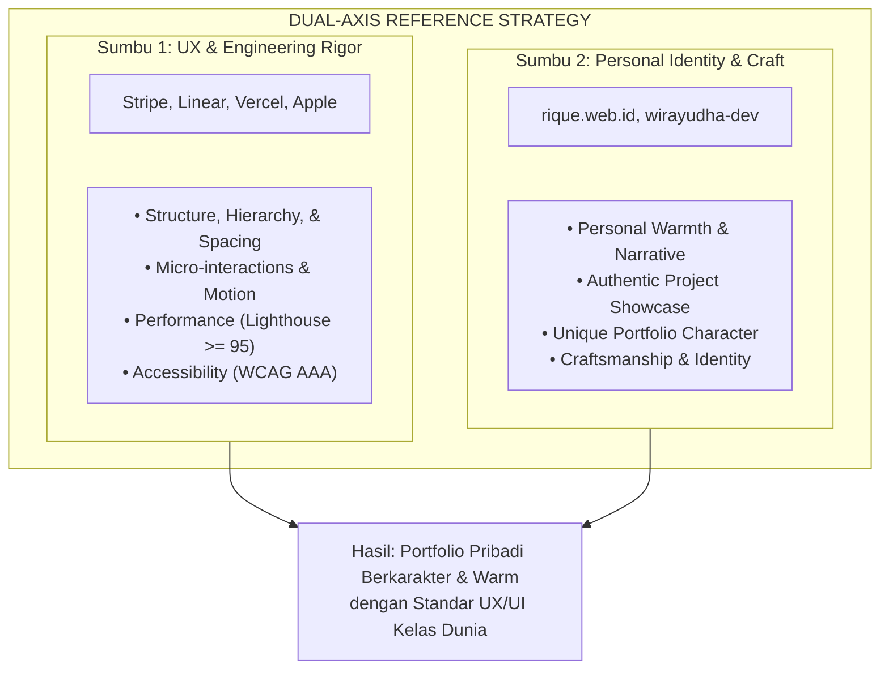

# 03. RESEARCH & BENCHMARK ANALYSIS (DESIGN DNA & SPECIFICATIONS)

## 0. Core Design DNA Motto

> **"Never copy, always reinterpret."**
>
> Kita tidak pernah menyalin layout, komponen, atau visual dari website mana pun secara mentah. Peran kita adalah memahami **alasan UX di balik keputusan desain referensi**, kemudian mengadaptasinya menjadi identitas digital yang otentik dan unik khusus untuk Grandy Alexander.

---

## 1. Dual-Axis Reference Strategy (UX vs. Visual Identity)

Untuk mencegah produk ini terasa seperti *landing page perusahaan SaaS dingin yang ditempeli CV*, kami memisahkan dua sumbu acuan referensi secara tegas:



### A. Sumbu UX & Engineering Rigor (World-Class Product Standards)
* **Mengacu Pada**: Stripe, Linear, Vercel, Apple.
* **Fokus Ekstraksi**: Kualitas *spacing*, hirarki tipografi, navigasi tanpa hambatan (*frictionless*), kebersihan arsitektur komponen, pergerakan animasi fungsional ($\le 200\text{ms}$), dan skor performa tinggi.

### B. Sumbu Character & Visual Identity (Authentic Personal Portfolio)
* **Mengacu Pada**: Portofolio berkarakter seperti `rique.web.id` dan `wirayudha-dev`.
* **Fokus Ekstraksi**: Kehangatan narasi personal, rasa *craftsmanship*, cara mempresentasikan project sebagai cerita karya (*builder's journey*), dan identitas yang membumi tanpa terasa kaku ala perusahaan B2B.

---

## 2. Reference Mapping & Design Principles Table

| Website Referensi | Kategori Sumbu | Pola yang Diadopsi (ADOPT) | Pola yang Ditolak (REJECT) | Justifikasi UX & Reinterpretasi |
| :--- | :--- | :--- | :--- | :--- |
| **Stripe** | UX & Engineering | • Hirarki tipografi kontras tinggi.<br>• Diagram arsitektur sistem bersih. | • WebGL 3D Canvas berat.<br>• Gradien SaaS berlebihan. | *Diagram sistem diadaptasi untuk verifikasi kompetensi teknis recruiter dalam 30 detik.* |
| **Linear** | UX & Engineering | • *Clean Dark/Light balance*.<br>• *Subtle 1px borders* (`#27272A` / `#E4E4E7`). | • Navigasi yang terlalu berfokus pada *keyboard-only*. | *Reinterpretasi estetika minimalis agar tetap intuitif bagi HR & recruiter non-teknis.* |
| **Vercel** | UX & Engineering | • Skema warna Monokromatik Semantik.<br>• Kecepatan muat instan. | • Kesan visual yang terlalu dingin/tanpa rasa personal. | *Direinterpretasi dengan menggabungkan kecepatan Vercel dan kehangatan Brand Story Grandy.* |
| **Apple** | UX & Engineering | • *Headline Copywriting* singkat.<br>• *Whitespace* melimpah. | • *Scroll-jacking*.<br>• Video autoplay besar. | *Whitespace dipakai untuk kecermatan pindaian, menolak scroll-jacking agar pengguna tetap memegang kontrol.* |
| **rique.web.id & wirayudha-dev** | Personal Identity | • Sentuhan personal & identitas portfolio yang otentik.<br>• Penyajian project sebagai *journey karya*. | • Layout yang tidak terstruktur atau kurang berpatokan pada data. | *Mengadopsi kehangatan pameran karya pribadi yang dikombinasikan dengan kedisiplinan rekayasa.* |

---

## 3. Sticky Glassmorphic Header Specification

Navbar bertindak sebagai kompas navigasi utama yang selalu siap diakses tanpa menghalangi konten.

### A. Perilaku Scroll & State Transition
* **State 1: Top of Page ($Y = 0\text{px}$)**:
  - *Background*: Transparent (`rgba(0,0,0,0)`).
  - *Border*: Transparent (`1px solid transparent`).
  - *Shadow*: None.
* **State 2: Scrolled ($Y > 20\text{px}$)**:
  - *Trigger*: Scroll memicu pembacaan offset $Y > 20\text{px}$.
  - *Transition*: CSS `transition: background 200ms ease, border 200ms ease, backdrop-filter 200ms ease`.

### B. Spesifikasi Parameter Visual Per Mode

| Parameter CSS | Light Mode ($Y > 20\text{px}$) | Dark Mode ($Y > 20\text{px}$) |
| :--- | :--- | :--- |
| **Background Fill** | `rgba(255, 255, 255, 0.75)` | `rgba(9, 9, 11, 0.75)` |
| **Backdrop Filter** | `blur(12px) saturate(180%)` | `blur(12px) saturate(180%)` |
| **Border Bottom** | `1px solid rgba(228, 228, 231, 0.8)` | `1px solid rgba(39, 39, 42, 0.8)` |
| **Box Shadow** | `0 4px 20px -2px rgba(0, 0, 0, 0.05)` | `0 4px 20px -2px rgba(0, 0, 0, 0.5)` |
| **Z-Index** | `z-index: 50` | `z-index: 50` |

### C. Alasan UX & Product Design
1. **Zero-Friction Access**: Recruiter tidak perlu melakukan scroll kembali ke atas untuk berpindah halaman atau mengunduh CV.
2. **Contextual Awareness**: *Backdrop-blur* 12px menjaga kontras teks navbar tetap terbaca sempurna di atas elemen halaman yang melintas di bawahnya.

---

## 4. Section Layout Width Specification

```text
[ Hero Section ]      ──► max-w-4xl (896px)   : Fokus utama di tengah (Center-focused)
[ About Section ]     ──► max-w-3xl (768px)   : Optimal line length untuk membaca artikel (60-75 karakter)
[ Projects Grid ]     ──► max-w-6xl (1152px)  : Multi-column card layout (2-Column Grid)
[ Journey Drawer ]    ──► max-w-2xl (672px)   : Focused reading pane untuk alur 7-tahap
[ Contact Section ]   ──► max-w-2xl (672px)   : Minimalist form & direct contact links
```

1. **Hero Section (`max-w-4xl` / 896px)**: Menjaga narasi *Positioning Statement* dan CTA tetap terkonsentrasi di area pandang utama.
2. **About Me / Brand Story (`max-w-3xl` / 768px)**: Keterbacaan paragraf ideal (60–75 karakter per baris).
3. **Projects Grid (`max-w-6xl` / 1152px)**: Memberikan ruang 2-kolom kartu *project* yang luas di desktop tanpa terasa sesak.
4. **Signature Experience Drawer (`max-w-2xl` / 672px)**: Komponen *slide-over drawer* fokus sebagai jalur baca linier 7-tahap.
5. **Contact Section (`max-w-2xl` / 672px)**: Meminimalkan jarak antar-field pada form kontak.

---

## 5. Comprehensive Motion Guideline Matrix

| Tipe Elemen | Trigger / Event | Durasi | CSS / Motion Easing Curve | Perilaku Visual |
| :--- | :--- | :--- | :--- | :--- |
| **Hover Feedback** | Mouse Enter / Leave | `150ms` | `cubic-bezier(0.16, 1, 0.3, 1)` | Elevasi halus (`translateY(-2px)`), perubahan opacity border. |
| **Button Click** | Active / Press | `100ms` | `cubic-bezier(0.4, 0, 0.2, 1)` | Skala mikro (`scale(0.98)`). |
| **Card Elevate** | Hover Card | `200ms` | `cubic-bezier(0.16, 1, 0.3, 1)` | Shadow expansion & subtle border brighten. |
| **Modal / Dialog** | Toggle Open/Close | `200ms` | `cubic-bezier(0.16, 1, 0.3, 1)` | Fade in (`opacity: 0 -> 1`) & subtle scale (`0.95 -> 1.0`). |
| **Journey Drawer** | Toggle Open/Close | `250ms` | `cubic-bezier(0.32, 0.72, 0, 1)` | Slide in dari kanan (`translateX(100% -> 0)`). |
| **Scroll Reveal** | Intersection Observer | `300ms` | `cubic-bezier(0.16, 1, 0.3, 1)` | Fade up (`opacity: 0 -> 1`, `translateY(12px -> 0)`). *Run once*. |
| **Page Transition** | Route Change | `200ms` | `cubic-bezier(0.4, 0, 0.2, 1)` | Fast opacity fade out/in. |

### Accessibility Rule (`prefers-reduced-motion`)
```css
@media (prefers-reduced-motion: reduce) {
  *, ::before, ::after {
    animation-duration: 0.01ms !important;
    animation-iteration-count: 1 !important;
    transition-duration: 0.01ms !important;
    scroll-behavior: auto !important;
  }
}
```

---

## 6. Expanded Adoption Matrix (Spesifikasi Eksplisit)

### A. Pola yang Wajib Diadopsi (ADOPTED PATTERNS)
1. **Semantic Monokromatik UI**: Skema warna netral berkejelasan tinggi dengan warna aksen terbatas untuk status.
2. **Explicit Tech Stack Badges**: Tag *monospace* statis (Next.js, TypeScript, AI Model, PostgreSQL) tanpa persentase.
3. **Dual-Layer Case Study Access**: Executive Card (30s) + 7-Step Journey Drawer (Deep Dive).
4. **Contextual Resume Button**: Tombol "Download CV" dengan info update & file size (PDF).
5. **Keyboard Accessible Focus Rings**: Focus ring tajam (`ring-2 ring-neutral-400 dark:ring-neutral-500`).
6. **Authentic Project Storytelling**: Menyajikan cerita pembuatan project berbasis rasa karya personal ala `rique.web.id` & `wirayudha-dev`.

### B. Pola yang Dilarang Keras (REJECTED PATTERNS)
1. **Direct Visual Copying**: Dilarang menyalin visual website mana pun tanpa reinterpretasi ("*Never copy, always reinterpret*").
2. **Cold SaaS Landing Page Vibe**: Dilarang membuat tampilan yang terasa kaku dan impersonal seperti website jualan software B2B.
3. **Rating Skill Bar / Circle**: Dilarang menampilkan persentase skill subjektif.
4. **Scroll-Jacking**: Dilarang mengintersepsi scroll alami browser.
5. **Heavy 3D WebGL / Particle Backgrounds**: Dilarang menggunakan background GPU-intensive.
6. **Autoplay Audio/Video**: Dilarang menjalankan media otomatis.
